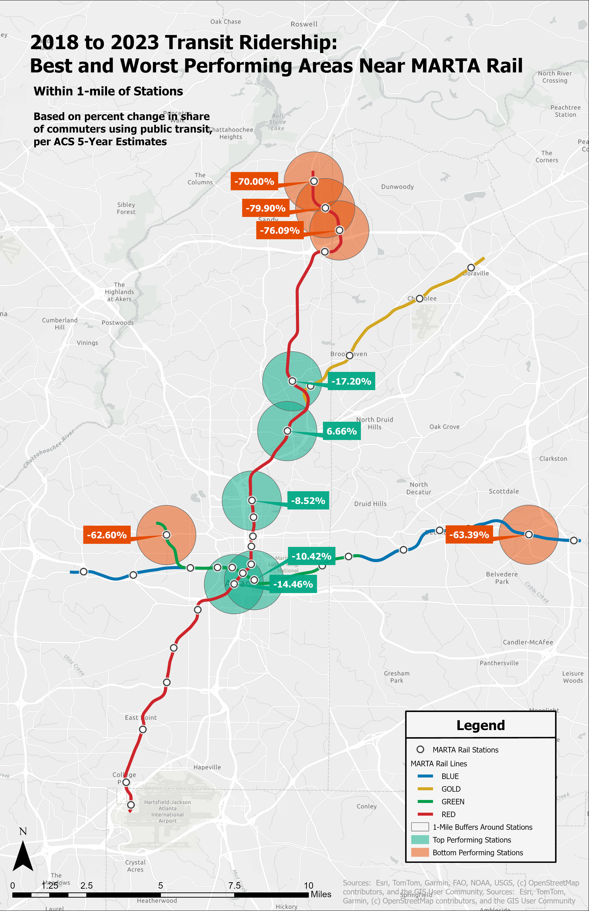

# 🏙️ Welcome! 
I'm Will Georgia, a Master’s student in Urban Analytics at Georgia Tech with a passion for urban design, urban transportation, and all components of the built urban environments we share. This portfolio showcases skills I’ve developed through hands-on coursework and case studies.

---

# 🚍 Park-and-Ride Travel Time Simulation with MARTA GTFS Data in R

This project analyzed park-and-ride travel times from census tract centroids in the Atlanta area to Midtown Station using:

- GTFS transit data from MARTA
- ACS demographic data
- OpenStreetMap road networks
- Spatial network analysis with `sfnetworks`
- Transit routing with `tidytransit`

👉 [View Interactive Report on RPubs](https://rpubs.com/wgeorgia6/1238230)

## Key Tools and Methods

- `tidytransit` and `gtfsrouter` for GTFS data
- `osmdata` and `sfnetworks` for street networks
- `tidycensus` for ACS data (household income & race)
- Spatial joins, centroid extraction, and travel time simulation

## Outputs and Conclusions

The report includes thematic maps and scatterplots showing relationships between:
- Household income and travel time
- Minority population share and travel time

Summary of Conclusions:
- Commute time was primarily influenced by geographic proximity
- Income and race trends were difficult to discern and deserve a deeper dive

---

# 🚇 Visualizing Changes in Public Transit Ridership Near MARTA Rail Stations (2018-2023)

## Overview

This map visualizes the **change in public transit commuting near MARTA rail stations in Atlanta** between 2018 and 2023. Using data from the **American Community Survey (ACS) 5-Year Estimates**, it focuses on areas **within a 1-mile buffer** around each rail station, representing a typical walkable catchment area.

The analysis compares the **percentage of workers commuting by public transit** in 2018 vs. 2023 to identify stations with the most significant changes over time.

**Created during my internship with the City of Atlanta Department of Transportation.**

## Key Takeaways

- Northern Red Line stations experienced **steep declines**, with some stations seeing reductions over 75%.
- Several central stations show **moderate decreases**, while one even saw **gains in transit mode share**.
- These patterns reflect broader shifts in commuting behavior, likely influenced by **COVID-19**, the **rise of remote work**, and ongoing changes in transit accessibility.

## Methodology

All geospatial analysis was conducted using **ArcGIS Pro**, supported by ACS data accessed via R’s `tidycensus` package.

### ArcGIS Geoprocessing Tools Used:

- **Buffer** – Created 1-mile buffers around each MARTA station.
- **Select Layer By Attributes** – Filtered census block groups relevant to the years 2018 and 2023.
- **Intersect** – Identified block groups that intersect each station's buffer.
- **Join Field** – Merged ACS data fields for 2018 and 2023.
- **Calculate Field** – Computed percent change in public transit commuting.
- **Select by Attributes** – Isolated top 5 increases and top 5 decreases in mode share.
- **Labeling with Callouts** – Labeled percent change using Maplex engine and custom halos for legibility.
- **Symbology** – Colored buffers to indicate increase (green) or decrease (orange) in transit usage.

## Design Choices

- **Station names are intentionally omitted** to maintain a clean layout and emphasize the magnitude and geography of change.
- Color-coded **callout labels** highlight the top 5 stations with the **largest increases** and **largest decreases** in transit commuting share.
- A custom legend clarifies MARTA rail lines, buffer zones, and top-performing stations.

## Data Sources

- **ACS 5-Year Estimates (2014–2018 and 2019–2023)**: Table B08301 (Means of Transportation to Work), accessed via [`tidycensus`](https://walker-data.com/tidycensus/) in R.
- **MARTA Station and Rail Line GIS Data**: Georgia GIS Clearinghouse and MARTA Open Data Portal.

## Tools Used

- ArcGIS Pro 3.x
- R (for ACS data extraction and prep)

---

# 🏙️ Walkability and the Built Environment

This project explores the visual and physical elements of walkability in the built environment using **computer vision** and **street-level imagery** in R. The analysis explores the features AI can offer to evaluate urban form using publicly available geospatial data and imagery.

## Project Overview

Using OpenStreetMap and Google Street View APIs, the workflow:
- Extracts street imagery from selected intersections in Atlanta.
- Applies **computer vision** techniques to classify and quantify key walkability indicators like sidewalks, greenery, road presence, and pedestrian infrastructure.
- Aggregates these indicators by location to reveal spatial patterns in walkability.

## Key Tools & Skills

- **R programming**: tidyverse, osmdata, streetview, keras
- **Computer vision**: Pre-trained convolutional neural networks (CNNs) to classify elements from images
- **Geospatial analysis**: spatial joins, point buffering, and street network mapping
- **Data visualization**: Maps and plots to reveal walkability variation

## Results

- Generated a walkability score at the neighborhood scale.
- Identified spatial disparities in pedestrian-friendly design across the city.
- Provided a framework that can be applied to other cities using similar data inputs.

👉 [View Full Report on RPubs](https://rpubs.com/wgeorgia6/1245484)

---

## 🌲 GIS Capability Analysis: Pine Tree Viability in North Texas

**Objective:** Can Christmas trees grow near Dallas, Texas? Let's use GIS tools to conduct a capability analysis to find out.

**Approach:**
- Compared native habitat conditions of **Virginia Pine** and **Eastern White Pine** to North Texas environmental data.
- Pulled geospatial layers on temperature, precipitation, soil pH, and elevation.
- Classified each factor into ordinal ranks (0 = not suitable to 2 = suitable).
- Combined layers using Raster Calculator in ArcGIS Pro to score overall viability (0–8 scale).

**Outcome:**  
Viable areas were concentrated in East Texas, with temperature being the most limiting factor across the study area.

👉 [Read the Full Report](./Pine_Trees_Capability_Analysis_2025_02_19.pdf)

---

# 🧱 Estimating Population inside Buildings with Dasymetric Mapping

This lab completed in my Environmental GIS course explores methods to estimate population within buildings in Manhattan using zoning, land cover, and census data. The analysis combines spatial joins, population density calculations, and techniques to refine population estimates with ancillary data.

## Skills Demonstrated
- Spatial join of building centroids with census blocks
- Population estimation using building area and volume
- Parsing FIPS codes into tract, block group, etc.
- Accuracy trade-offs between zoning and land cover
- Use of dot density symbology and 3D visualization

## Key Outputs
- Scatterplot comparing building population by footprint (area) vs. building population by volume
- Dot density maps of estimated building populations  
- Summary table aggregating population by zoning type  
- 3D Local Scene of extruded Manhattan buildings

👉 [View the Full Report (PDF)](CP%206541%20LAB%202%20WG%202025-01-23.pdf)

---

# 🐑 Least-Cost Path and Cost Distance Modeling

This assignment, also from Environmental GIS, applies raster-based modeling to identify optimal locations for observing sheep in their native habitat factoring in environmental friction.

## Skills Demonstrated
- Creating Euclidean and cost distance rasters
- Defining friction surfaces using land cover data (e.g., vegetation, streams)
- Understanding isotropic vs. anisotropic distance modeling
- Extracting and interpreting least-cost paths
- Symbolizing spatial risk and path difficulty

## Key Outputs
- Friction surface raster with symbology detailing strenuousness
- Risk-weighted point analysis
- Least-cost path network and cost profiling
- Comparison of Euclidean vs. cost paths (length and difficulty)

👉 [View the Full Report (PDF)](CP%206541%20LAB%2011%20WG%202025-04-22.pdf)

---

# 🗺️ GIS StoryMap: Dallas Parks: Decent or Deficient?

**Overview:**  
This ArcGIS StoryMap takes a high-level looks at what factors into Dallas' poor parks ranking.

**Features:**
- Map-based storytelling using **ArcGIS StoryMaps**
- Feature layers pulled from the city of Dallas and the Census Bureau
- Geoprocessing tools used to take a closer look at park coverage in the city by census tract

👉 [Explore the StoryMap](https://arcg.is/1aO1Cv1)

---

## 📬 Contact

- 📧 william.georgia@gatech.edu
